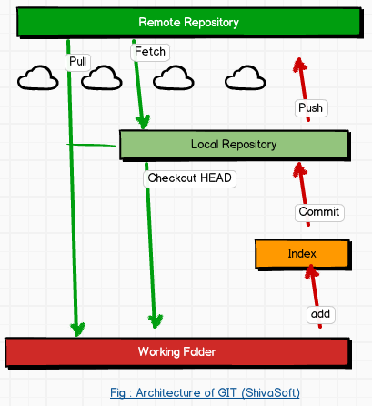

<h2>GIT</h2>
&nbsp;GIT이란 소스코드를 효율적으로 관리하기 위해 사용 하는 <u>분산 버전 관리 시스템</u>이다.
 하나의 서버에 여러 클라이언트가 연결되는 것이 아니라
 클라이언트 별로 내부 로컬 저장소가 존재하기 때문에 사용자가 데이터를 잃을 확률이 극히 적다.

<h3>타임머신과도 같은 역할</h3>
&nbsp;개발자들이 협업하거나 파일들을 유지/보수 할때, 특히 코드를 수정했지만 수정하기 전으로 되돌려야 할 때 등
 버전별 소스코드를 저장 및 관리가 가능한 GIT이 필요하다.
 GIT을 통해 수정 이전으로 돌아가는 것은 더욱 완벽한 개발자에게 아주 용이하다.
 
<h3>Git에 저장되는 버전의 워킹 플로우</h3>

 
 <strong> 1. Directory (repository)</strong>:Git의 가장 핵심적인 파트, Commit을 통해 파일이나 폴더를 저장해 두는 곳
 그런데 Git 저장소가 제공하는 좋은 점 중 하나는 파일이 변경 이력 별로 구분되어 저장한다는 것.
 &nbsp; 1-1. 원격 저장소(Remote Repository): 파일이 원격 저장소 전용 서버에서 관리되며 여러 사람이 함께 공유
 &nbsp; 1-2. 로컬 저장소(Local Repository): 내 PC에 파일이 저장되는 개인 전용 저장소
 평소에는 내 PC의 로컬 저장소에서 작업하다가 작업한 내용을 공개하고 싶을 때에 원격 저장소에 업로드
 <strong>2. Working Directory</strong> : 소스코드를 작업하는 영역으로 코드 추가, 수정, 삭제하는 작업이 이루어짐
 <strong>3. Staging Area (Index)</strong> : Working Directory 에서 Repository로 정보가 저장되기 전 준비 영역
 &emsp;- 파일 상태를 기록, 스테이징 한다고도 표현함, Staging Area로 불리기도함
 &emsp;- git add 명령어로 Working Directory 에서 Index 영역으로 정보가 저장됨
 &emsp;- git commit 명령어로 Index 영역에서 Repository로 정보가 저장됨
 <strong>4. Stash</strong> : 일반적인 Working Directory > Index > Repository 로 이루어지는 영역과는 다른 별개의 임시영역
  임시적으로 작업사항을 저장해놓고 나중에 꺼내올 수 있음
 <strong>~플로우~</strong>
 &nbsp;- 워킹디렉토리에서 파일을 수정한다.
 &nbsp;- 스테이징에 파일을 Stage해서 커밋할 스냅샷을 만든다. 모든 파일을 추가할 수 있고 선택도 가능
 &nbsp;- 스테이징에 있는 파일들을 커밋해 디렉토리에 영구적인 스냅샷을 저장
 
<h3>Git의 세가지 상태</h3>
&nbsp;- Committed : Git 디렉토리에 존재하는 파일들
 &nbsp;- Modified : Git 디렉토리로부터 워킹트리에 Checkout 하고 파일을 수정하고 Staging Area에 추가
 &nbsp;- Staged : Git 디렉토리로부터 워킹트리에 Checkout 하고 파일을 수정했지만 Staging Area에 추가하지 않음
 
<h2>1. 버전관리</h2>
<strong>git을 사용하지 않은 로컬버전관리를 생각해보자.</strong>
 &nbsp;1. 코드를 짠다. > 2. 저장한다. 저장명 : 코드1
 &nbsp;3. 코드를 수정한다. > 4. 저장한다. 저장명 : 코드2
 &nbsp;5. 코드를 수정한다 > 6. 저장한다. 저장명 : 코드3
 &nbsp;이하 무한 반복... 지우거나, 잘못 고치거나, 잘못 복사하거나, 용량이 무지막지해지거나...
 &nbsp;하지만 Git을 통해 버전을 관리한다면?
 
 <strong>어떻게 버전관리를 할까?</strong>
 
 

 
 
<strong>1) COMMIT</strong>
 
 
 
 저장하고자 하는 전체 내용이 사진을 찍듯 로컬저장소에 저장
 이후에도 의미있는 변경사항이 있을 때 마다 commit 을 통해 변경사항만 저장할 수 있음
 >commit을 여러번해도 용량을 몇배로 차지하지 않음
  <strong>2) PUSH</strong>
 commit명령어는 로컬 저장소에 코드 변경 이력을 남기기 위해 사용되기 때문에 아무리 많이 변경해도 원격저장소는 알 수 없음
 때문에 PUSH 명령어를 통해 그동안 로컬 저장소에 남겨놓은 코드 변경 이력들을 원격 저장소로 전송
  <strong>3) BRANCH</strong>
 독립적으로 어떤 작업을 진행하기 위한 개념
 주가 되는 코드는 메인(master) 브렌치에서, 시도해볼만한 코드는 이외의 브렌치에서 작업을 이어가고
 후에 실제로 적용을 원한다면 메인 브렌치에서 합칠 수 있음
 즉, 버전별로 매번 따로 복사&저장할 필요가 없음!
 master 기준으로 new를 브랜치하면 master와 똑같은 소스코드가 new에도 적용되지만,
 이후로 new 코드를 수정하면 master와 new는 서로 다른코드가 되어 갈라짐
  <strong>4) PULL , FETCH </strong>
 - fetch : 원격 저장소로 부터 변경 내역을 가져 오는것이고 직접 로컬 branch에 반영하지 않음
 - pull : 원격 저장소로 부터 변경 내역을 가져와 로컬 branch에 merge 작업
 * merge : 서로 다른 브랜치에서 서로 다른 코드가 개발되었고 이를 합치는 과정
  PULL/FETCH 하지 않으면 최근에 커밋한 자료를 볼 수 없음!
<h2>2. 백업</h2>
다른 컴퓨터에 <strong>복제</strong> 하는 것 > 내 컴퓨터에서 유실되었다고 하더라도 언제든 다시 불러낸다.
 내가 만들어낸 것을 다른 어떤 컴퓨터에 저장할 것인가?
 그것을 도와주는 것이 "git hub"
 
 여기서 잠깐!
 <strong>git과 git hub의 차이점</strong>
 git에서는 자신의 로컬 소스코드를 관리(add,commit,merge) 할 수 있고
 git hub는 내가 로컬에서 git으로 관리하는 자료들을 다른 사람과 공유하거나 '백업' 하는 웹사이트
 <strong>[정리하자면]</strong>
 git : local내에서 소스코드를 관리하는 것, 버전관리를 위한 소프트웨어 (Git에는 다양한 종류가 있음)
 github : local에서 관리한 소스코드를 업로드하고 공유할 수 있는 공간 (Git의 종류 중 하나로 가장 많이 사용됨)
<h2>3. 협업</h2>
다른 구성원이 작업한 내용을 다운받고, 내가 작업한 것을 전송하기도 함
  이 과정들이 체계적으로 기록되고 관리되기 때문에 코드를 수정한 작업자를 찾아내거나 과거로 코드를 되돌려 문제를 해결할 수 있음
  무료사용자라면 본인의 코드를 오픈소스로 사용하게 되는데
  덕분에 전세계의 무수한 오픈소스 프로젝트들이 git hub를 통해 공유되고 더 좋은 기능을 구현하도록 제안을 받거나 기여할 수 있음
  <h2>Git의 특징</h2>
 1. 데이터를 시간순으로 스냅샷처럼 저장
  2. 로컬에서 실행이 가능하기 때문에 서버없이 조회, 오프라인 상태이거나 VPN 연결이 불가해도 조회할 수 있음
  3. 가지치기(Branch)와 병합(Merge) - 여러가지 버전을 만들어 시도하고 후에 병합 가능
  4. 로컬에서 작업하기에 가볍고 빠르면서 메인 코드를 모두 가지고 있기 때문에 분산 작업에도 효율적
  5. Staging Area (준비영역) 이 있어 수정한 내용을 반영하기 전 검토할 수 있는 단계를 거침
  6. 오픈소스형태로 다른 사람들의 작업물을 볼 수 있는 기회
  
  
